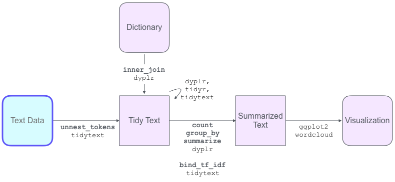
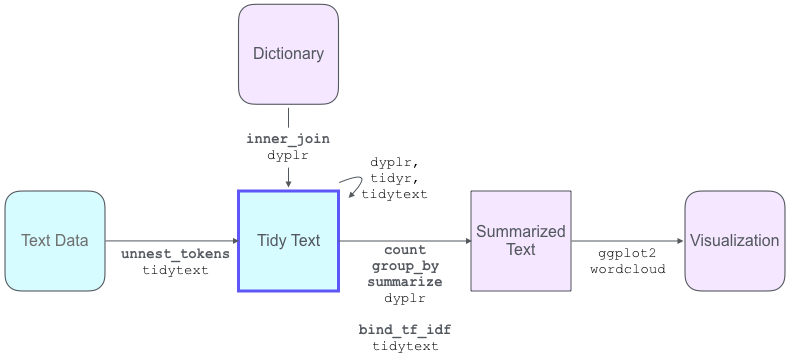
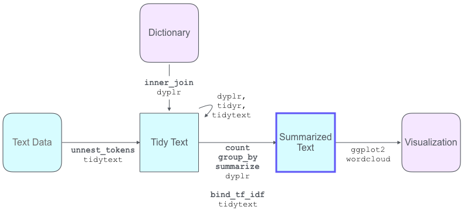

---
jupyter:
  jupytext:
    text_representation:
      extension: .Rmd
      format_name: rmarkdown
      format_version: '1.2'
      jupytext_version: 1.5.2
  kernelspec:
    display_name: R
    language: R
    name: ir
---

<!-- #region -->
# Text Analysis Workshop


Based on [SICSS 2020](https://compsocialscience.github.io/summer-institute/curriculum) (Summer Institute in Computational Social Science)

- [Basic Text Analysis in R](https://compsocialscience.github.io/summer-institute/2020/materials/day3-text-analysis/basic-text-analysis/rmarkdown/Basic_Text_Analysis_in_R.html)
- [Dictionary-based Text Analysis](https://compsocialscience.github.io/summer-institute/2020/materials/day3-text-analysis/dictionary-methods/rmarkdown/Dictionary-Based_Text_Analysis.html#when-should-i-use-a-dictionary-based-approach)

Mindy Chang

<!-- #endregion -->

<!-- #region toc=true -->
<h1>Table of Contents<span class="tocSkip"></span></h1>
<div class="toc"><ul class="toc-item"><li><span><a href="#Setup" data-toc-modified-id="Setup-0"><span class="toc-item-num">0&nbsp;&nbsp;</span>Setup</a></span><ul class="toc-item"><li><span><a href="#Install-packages" data-toc-modified-id="Install-packages-0.1"><span class="toc-item-num">0.1&nbsp;&nbsp;</span>Install packages</a></span></li><li><span><a href="#Load-packages" data-toc-modified-id="Load-packages-0.2"><span class="toc-item-num">0.2&nbsp;&nbsp;</span>Load packages</a></span></li></ul></li><li><span><a href="#Load-the-data" data-toc-modified-id="Load-the-data-1"><span class="toc-item-num">1&nbsp;&nbsp;</span>Load the data</a></span><ul class="toc-item"><li><span><a href="#Look-at-the-data-format" data-toc-modified-id="Look-at-the-data-format-1.1"><span class="toc-item-num">1.1&nbsp;&nbsp;</span>Look at the data format</a></span></li><li><span><a href="#Look-at-individual-column-values" data-toc-modified-id="Look-at-individual-column-values-1.2"><span class="toc-item-num">1.2&nbsp;&nbsp;</span>Look at individual column values</a></span></li></ul></li><li><span><a href="#Format-and-clean-the-text" data-toc-modified-id="Format-and-clean-the-text-2"><span class="toc-item-num">2&nbsp;&nbsp;</span>Format and clean the text</a></span><ul class="toc-item"><li><span><a href="#Tweet-specific-cleaning" data-toc-modified-id="Tweet-specific-cleaning-2.1"><span class="toc-item-num">2.1&nbsp;&nbsp;</span>Tweet specific cleaning</a></span></li><li><span><a href="#Tokenize-the-data" data-toc-modified-id="Tokenize-the-data-2.2"><span class="toc-item-num">2.2&nbsp;&nbsp;</span>Tokenize the data</a></span></li><li><span><a href="#Convert-to-lowercase" data-toc-modified-id="Convert-to-lowercase-2.3"><span class="toc-item-num">2.3&nbsp;&nbsp;</span>Convert to lowercase</a></span></li><li><span><a href="#Remove-punctuation" data-toc-modified-id="Remove-punctuation-2.4"><span class="toc-item-num">2.4&nbsp;&nbsp;</span>Remove punctuation</a></span></li><li><span><a href="#Remove-stopwords" data-toc-modified-id="Remove-stopwords-2.5"><span class="toc-item-num">2.5&nbsp;&nbsp;</span>Remove stopwords</a></span></li><li><span><a href="#Remove-numbers" data-toc-modified-id="Remove-numbers-2.6"><span class="toc-item-num">2.6&nbsp;&nbsp;</span>Remove numbers</a></span></li><li><span><a href="#Remove-extra-white-spaces" data-toc-modified-id="Remove-extra-white-spaces-2.7"><span class="toc-item-num">2.7&nbsp;&nbsp;</span>Remove extra white spaces</a></span></li><li><span><a href="#Stemming" data-toc-modified-id="Stemming-2.8"><span class="toc-item-num">2.8&nbsp;&nbsp;</span>Stemming</a></span></li></ul></li><li><span><a href="#Word-counting" data-toc-modified-id="Word-counting-3"><span class="toc-item-num">3&nbsp;&nbsp;</span>Word counting</a></span><ul class="toc-item"><li><span><a href="#Create-a-word-count-dataframe" data-toc-modified-id="Create-a-word-count-dataframe-3.1"><span class="toc-item-num">3.1&nbsp;&nbsp;</span>Create a word count dataframe</a></span></li><li><span><a href="#Visualize-word-frequencies" data-toc-modified-id="Visualize-word-frequencies-3.2"><span class="toc-item-num">3.2&nbsp;&nbsp;</span>Visualize word frequencies</a></span></li><li><span><a href="#WordClouds" data-toc-modified-id="WordClouds-3.3"><span class="toc-item-num">3.3&nbsp;&nbsp;</span>WordClouds</a></span></li><li><span><a href="#Bigrams-and-n-grams" data-toc-modified-id="Bigrams-and-n-grams-3.4"><span class="toc-item-num">3.4&nbsp;&nbsp;</span>Bigrams and n-grams</a></span></li><li><span><a href="#tf-idf:-Term-Frequency-Inverse-Document-Frequency" data-toc-modified-id="tf-idf:-Term-Frequency-Inverse-Document-Frequency-3.5"><span class="toc-item-num">3.5&nbsp;&nbsp;</span>tf-idf: Term Frequency Inverse Document Frequency</a></span></li></ul></li><li><span><a href="#Dictionary-based-text-analysis" data-toc-modified-id="Dictionary-based-text-analysis-4"><span class="toc-item-num">4&nbsp;&nbsp;</span>Dictionary-based text analysis</a></span><ul class="toc-item"><li><span><a href="#Selecting-for-keywords" data-toc-modified-id="Selecting-for-keywords-4.1"><span class="toc-item-num">4.1&nbsp;&nbsp;</span>Selecting for keywords</a></span></li><li><span><a href="#Sentiment-analysis" data-toc-modified-id="Sentiment-analysis-4.2"><span class="toc-item-num">4.2&nbsp;&nbsp;</span>Sentiment analysis</a></span><ul class="toc-item"><li><span><a href="#Select-a-dictionary" data-toc-modified-id="Select-a-dictionary-4.2.1"><span class="toc-item-num">4.2.1&nbsp;&nbsp;</span>Select a dictionary</a></span></li><li><span><a href="#Count-sentiment-words" data-toc-modified-id="Count-sentiment-words-4.2.2"><span class="toc-item-num">4.2.2&nbsp;&nbsp;</span>Count sentiment words</a></span></li><li><span><a href="#Count-sentiments-by-tweet" data-toc-modified-id="Count-sentiments-by-tweet-4.2.3"><span class="toc-item-num">4.2.3&nbsp;&nbsp;</span>Count sentiments by tweet</a></span></li><li><span><a href="#Examine-sentiment-labels" data-toc-modified-id="Examine-sentiment-labels-4.2.4"><span class="toc-item-num">4.2.4&nbsp;&nbsp;</span>Examine sentiment labels</a></span></li><li><span><a href="#Plot-sentiments-over-time" data-toc-modified-id="Plot-sentiments-over-time-4.2.5"><span class="toc-item-num">4.2.5&nbsp;&nbsp;</span>Plot sentiments over time</a></span></li><li><span><a href="#Linear-model-for-favorites-based-on-sentiment-count" data-toc-modified-id="Linear-model-for-favorites-based-on-sentiment-count-4.2.6"><span class="toc-item-num">4.2.6&nbsp;&nbsp;</span>Linear model for favorites based on sentiment count</a></span></li></ul></li><li><span><a href="#Linguistic-Inquiry-Word-Count-(LIWC)" data-toc-modified-id="Linguistic-Inquiry-Word-Count-(LIWC)-4.3"><span class="toc-item-num">4.3&nbsp;&nbsp;</span>Linguistic Inquiry Word Count (LIWC)</a></span></li></ul></li><li><span><a href="#Appendix" data-toc-modified-id="Appendix-5"><span class="toc-item-num">5&nbsp;&nbsp;</span>Appendix</a></span></li></ul></div>
<!-- #endregion -->

**Goals**
- Introduction to the basics of text analysis and dictionary-based methods
- Text analysis is doable! Much of the code is reusable
- Learn limitations and general things to look out for

We will step through loading and cleaning a collection of tweets for text analysis. In this session, we will look at word counting and dictionary-based text analysis methods like sentiment analysis.


___Some operational details:___

This session is a [Binder](https://mybinder.org/) instance of a [Jupyter notebook](https://jupyter.org/). This is your own copy of the notebook, where you can edit the code and run it interactively.  

The binder session will time out after 10 minutes of inactivity. If this happens, you will need to restart the binder. Reloading the current page will not work. 

[](https://mybinder.org/v2/gh/MindyChang/text-analysis-workshop/master?filepath=index.ipynb)


## Setup 
### Install packages

We only need to install packages once - they have already been installed in this binder.
- *tidyverse*
    - *dyplr* for dataframe manipulation
    - *tidyr* for formatting into tidy data
    - *ggplot2* for plotting
    - *lubridate* for working with dates and times
- *tidytext* for getting text data into a tidy format
- *SnowballC* for getting word stems
- *stringr* for manipulating strings
- *wordcloud* for generating word clouds

In the R console, 
```
install.packages("tidyverse")
install.packages("tidytext")
install.packages("SnowballC")
install.packages("stringr")
install.packages("wordcloud")
```


### Load packages
**Running code interactively**

To run a code block, click the gray section and type *shift+enter* (or click the play button on mobile). 

- The `In [ ]` will indicate the code state. 
    - `In [*]` means it's currently running. 
    - `In [5]` means it finished running, where the `[number]` is a running count of the number of blocks you have run.    
- After running a block, the cursor will automatically advance to the next block.


```{r}
library(dplyr)
library(tidyr)
library(ggplot2)
library(lubridate)
library(tidytext)
library(SnowballC)
library(stringr)
library(wordcloud)
```

<!-- #region -->
## Load the data




**Getting Twitter data**
- Retrieve data with the Twitter API

    - Limited to the last 7-9 days
    - Subject to rate limitations
    - Twitter may sample or not provide a complete set of tweets in searches

- Use an existing Twitter dataset

    - Hydrate using the tweet id to retrieve the original tweet info

For this workshop, we have an option of 3 different datasets (each with ~4000 tweets), which have already been extracted via the twitter API using the `rtweet` package and saved as a Rdata file.
- Trump's tweets collected between 2017-02-05 and 2018-05-18, named `trumptweets`
- A collection of tweets that contain the word "covid" in a 10 minute window on 2020-07-29, named `covidtweets`
- A collection of tweets that contain the phrase "mental health" in a 3 hour window on 2020-07-29 named `mentalhealthtweets`

We will rename the data by assigning the variable name `rawtweets` using the assignment operator `<-` so that all of the following code can work with any Twitter dataset.
<!-- #endregion -->

```{r}
title <- 'Mental Health' # other options include: 'Covid', 'Trump'

if (title == 'Trump')
{
    load(url("https://cbail.github.io/Trump_Tweets.Rdata"))
    rawtweets <- trumptweets 
    keywords <- c("")
} else if (title =='Covid')
{
    load("data/covidtweets.RData")
    rawtweets <- covid_tweets
    keywords <- c("covid")
} else if (title == 'Mental Health')
{
    load("data/mentalhealthtweets.RData")
    rawtweets <- mentalhealthtweets
    keywords <- c("mental", "health")
} else
{
    warning('Pick a valid dataset from {"Trump","Covid","Mental Health"}')
}

paste("Loaded", title , "tweet dataset")
```

### Look at the data format
The data is formatted as a data frame, which is a standard table, where the top row contains column names and each row contains data about a single tweet.

- The `head()`function returns a the first few rows of `rawtweets`. 

    - You can change the number in 
    `head(rawtweets, #) `
    for the number of rows you want to see.

Some columns of note:

- `status_id` is the unique tweet id
- `created_at` contains the timestamp of the tweet
- `screen_name` is the twitter handle
- `text` contains the tweet

```{r}
# preview rawtweets
head(rawtweets,5)
```

### Look at individual column values
- The `names()` function lists the column names

- The `select()` function lets us select which columns we want to output

- The pipe operation `%>%` provides an elegant way to sequentially pass the data through different operations, using the output of one step as the input to the next.

```{r}
# print column names
names(rawtweets)
# display selected columns
rawtweets %>%
  select('created_at', 'text', 'favorite_count','source') %>%
    head
```

The `$` operation selects a column like this: `[tablename]$[columnname]`

We can apply different operations to columns. Some example operations include:

| operation   | Description |                      
|-------------|-------------|
| `min`       | minimum     |
| `max`       | maximum     | 
| `nrow`      | # rows      | 
| `ncol`      | # columns   | 
| `unique`    | list of unique values  | 
| `n_distinct`| # unique values     | 
| `mean`| mean    | 
| `median`| median     | 
| `sd`| standard dev    | 

```{r}
# print summary information on individual columns
min(rawtweets$created_at)
max(rawtweets$created_at)
unique(rawtweets$country)
print(paste('# of rows: ', nrow(rawtweets)))

```

<!-- #region -->
## Format and clean the text
We want to clean the text to keep the most meaningful parts and shape it into the tidy text format for processing.

**Token** - a unit of analysis (e.g. words, sequence of words, sentence)

**Document** - a unit of context for each token (in this case - a single tweet)

**Tidy text format** - One row per token (word in this case) with column variables that have extra context (e.g. which document the word came from)




<!-- #endregion -->

### Tweet specific cleaning

**Filter out retweets**

- The `filter()` function selects for rows that fit the specified criteria.

**Replace urls and usernames**

Depending on your goal, sometimes unique words are useful, and sometimes they add to the noise. Here we will abstract away specific urls and twitter handles (usernames).
- The `mutate()` function specifies how to overwrite or create a new column based on existing columns.

- The `str_replace_all()` function finds strings that match the specified criteria and replaces each one. 
    - We are finding all strings that look like urls and replacing them with the string "url"
    - And all strings that look like usernames and replacing them with the string "username"

A Regular expression, or regex, is sequence of characters that define a search pattern. GREP, which stands for “Globally search a Regular Expression and Print”, is a useful function for searching through text. Here is a [regex cheatsheet](https://rstudio.com/wp-content/uploads/2016/09/RegExCheatsheet.pdf). 

**Remove duplicate tweets**

Some twitter bots repost the same tweet from multiple accounts.

- The `distinct()` function keeps only unique rows. 

```{r}
# filter out retweets, find urls and @usernames - replace them with the string "url"
# regex for parsing tweets
url_regex <- "https?://[^\\s]+|&amp;|&lt;|&gt;|\bRT\\b"
user_regex <-"@[^\\s]+\\b"
rawtweets <- rawtweets %>%
   filter(is_retweet == FALSE) %>%
    mutate(text = str_replace_all(text, url_regex, "url")) %>%
    mutate(text = str_replace_all(text, user_regex, "username")) %>%
      distinct(text,.keep_all= TRUE)
        
```

### Tokenize the data

- The `unnest_tokens()` function separates the tweets into a tidy text format using the token specified. Here we are defining a token as a single word.


```{r}
tidy_tweets<- rawtweets %>%
    select(status_id, created_at, text) %>%
    unnest_tokens("word", text)

head(tidy_tweets)

```

### Convert to lowercase
Done automatically by the `unnest_tokens` function from the `tidytext` package


### Remove punctuation
Most punctuation is automatically removed by `unnest_tokens` from `tidytext`.

Here let's also exclude apostrophes.

```{r}
tidy_tweets$word <- gsub("\\’","",tidy_tweets$word)
```

### Remove stopwords
Common words such as “the”, “and”, “for”, “is”, etc. are often described as “stop words,” meaning that they should not be included in a text analysis. The `tidytext` package has a list of common stop words called `stop_words` that we can use. There are also some words specific to tweets that we would like to filter out, for example urls, "rt" for retweets, "t.co" for twitter link shortening, and "amp" for accelerated mobile pages.

- The `bind_rows` functions adds a tibble or dataframe to another dataframe
- The `anti_join` function removes rows that are found in the second dataframe.

```{r}
# load stop_words from tidytext package and remove them from tidy_tweets

#load stop_words
data("stop_words")
# add a few more stop words
custom_stop_words <- stop_words %>%
    bind_rows(tibble(word = append(c("url","username","rt","t.co","amp"),keywords),
                     lexicon = "custom"))

# remove stopwords and other insignificant words from tidy_tweets
tidy_tweets <-
   tidy_tweets %>%
      anti_join(custom_stop_words) 

print(head(rawtweets$text,1))
head(tidy_tweets,10)
```

Note: We might need to go back and edit our stopwords later if it removes words that are useful in our context.

For example, in Trump tweets:
- `tidytext` automatically converted all words to lowercase, and removed "UN" 
- `tidytext` automatically removed punctuation, and "Secretary-General" was reduced to only "secretary".
- removing stopwords removed the word "working"


### Remove numbers

```{r}
# remove numbers from tidy_tweets
tidy_tweets<-tidy_tweets[-grep("\\b\\d+\\b", tidy_tweets$word),]
```

### Remove extra white spaces

```{r}
# remove extra white spaces from tidy_tweets
tidy_tweets$word <- gsub("\\s+","",tidy_tweets$word)
```

### Stemming
We may want to reduce all words to their word stems (or roots).

For example: "unite", "united", "uniting", "unites" all reduce to "unit". 

The code below shows how to do it using the `snowballC` package, but we won't use it for now.

```{r}
# get word stems and save as tidy_tweets_stemmed
tidy_tweets_stemmed<-tidy_tweets %>%
      mutate_at("word", list(~wordStem((.), language="en")))
head(tidy_tweets_stemmed)
```

## Word counting 
Count the most commonly used words across tweets 




### Create a word count dataframe
Here we create a dataframe with a word column `word` and a count column `n`. 

Then we sort it from largest to smallest `n` to get the most frequently used words

```{r}
# count word frequencies and sort in descending order
top_words<-
   tidy_tweets %>%
    count(word) %>%
        arrange(desc(n))
head(top_words)
```

### Visualize word frequencies


Plot bar charts of word frequencies using `ggplot` from `ggplot2` package

```{r}
# plot the 20 most frequently used words
# function for bar plots given a dataframe that contains a "word" column and a count column (e.g. "n")
# we pass in: 
# - unit for the plot title ("words", "bigrams", "trigrams") 
# - and the name of the count column (e.g. "n")
plot_frequent_words <- function(word_counts, unit, param) {
    options(repr.plot.width=9, repr.plot.height=7)
    word_counts %>%
        ggplot(aes(x=get(param), y=reorder(word, get(param)), fill=-get(param)))+
          geom_bar(stat="identity")+
            theme_minimal()+
            theme(axis.text.x = element_text(angle = 60, hjust = 1, size=15),
                  axis.text.y = element_text(hjust = 1, size=15),
                  axis.title = element_text(size=15),
                  plot.title = element_text(hjust = 0.5, size=18))+
                ylab("Frequency")+
                xlab("# Occurences")+
                ggtitle(paste("Most Frequent", unit, "in", title, "Tweets", sep=" "))+
                guides(fill=FALSE)
}

top_words %>%
  slice(1:20) %>%
    plot_frequent_words("words", "n")
```

### WordClouds
Create wordclouds for qualitative insights using the `wordcloud` function from the `wordcloud` package
- `min.freq`: words with frequency below min.freq will not be plotted
- `max.words`: Maximum number of words to be plotted. Least frequent terms are dropped
- `random.order`: plot words in random order. If false, they will be plotted in decreasing frequency
- `rot.per`: proportion words with 90 degree rotation
- `colors`: color words from least to most frequent
    - choose other color themes from [RColorBrewer](https://www.r-graph-gallery.com/38-rcolorbrewers-palettes.html)

```{r}
# generate a wordcloud 
set.seed(1234) # for reproducibility 
wordcloud(words = top_words$word, freq = top_words$n, min.freq = 1,  
          max.words=200, random.order=FALSE, rot.per=0.3,colors=brewer.pal(8, "Dark2"))
```

### Bigrams and n-grams

Bigrams and n-grams refer to how text is tokenized, or the size of the unit of analysis.

- Unigrams are single words, bigrams are two-word phrases, and n-grams are n-word phrases.

**Bigrams**: 

We tokenize the text into bigrams and then filter out bigrams where either word is a stopword or contains numbers.

```{r}
# Bigrams
# Preprocess rawtweets by tokenizing into bigrams, removing stopwords from individual words,
# and then combining back together
tidy_bigrams <-rawtweets %>%
    select(created_at,text) %>%
        unnest_tokens(output=word, input=text, token = "ngrams", n = 2) %>% 
          separate(word, c("word1", "word2"), sep = " ") %>% 
              filter(!word1 %in% custom_stop_words$word) %>%
              filter(!word2 %in% custom_stop_words$word) %>% 
              filter(!grepl("\\d+|\\’", word1))%>%
              filter(!grepl("\\d+|\\’", word2))%>%
                  unite(word, word1, word2, sep = " ")

# count bigrams and arrange by frequency
top_bigrams <- tidy_bigrams %>%
    count(word) %>%
        arrange(desc(n))

# plot top bigrams
top_bigrams %>%
  slice(1:20) %>%
    plot_frequent_words("Bigrams" , "n")
```

**Trigram**

We tokenize the text into trigrams (3-word phrases) and then filter out trigrams where the first or third word is stopwords. We could also filter out trigrams where any of the 3 words are stopwords.

```{r}
# Trigrams
# Preprocess rawtweets by tokenizing into bigrams, removing stopwords from individual words,
# and then combining back together
tidy_trigrams <-rawtweets %>%
    select(created_at,text) %>%
        unnest_tokens(output=word, input=text, token = "ngrams", n = 3) %>% 
          separate(word, c("word1", "word2", "word3"), sep = " ") %>% 
              filter(!(word1 %in% custom_stop_words$word)) %>% 
              filter(!(word3 %in% custom_stop_words$word)) %>%
              filter(!grepl("\\d+|\\’", word1))%>%
              filter(!grepl("\\d+|\\’", word2))%>%
              filter(!grepl("\\d+|\\’", word3))%>%
                  unite(word, word1, word2, word3, sep = " ")%>%
                  filter(!grepl("NA NA NA", word)) # tweets shorter than 3 words

# count bigrams and arrange by frequency
top_trigrams <- tidy_trigrams %>%
    count(word) %>%
        arrange(desc(n))

# plot top bigrams
top_trigrams %>%
  slice(1:20) %>%
    plot_frequent_words("Trigrams","n")
```

### tf-idf: Term Frequency Inverse Document Frequency
A statistic for how important a word is to a document in a collection

Words that occur more frequently in one document (tweet) and less frequently in other documents should be given more importance as they are more useful for classification. This method is better suited for longer documents.

***Term frequency***

$tf(term)=\displaystyle(\frac{n_{occurences\ of\ term\ in\ document}}{n_{words\ in\ document}})$

***Inverse document Frequency:***

$idf(term)=\displaystyle log(\frac{n_{documents}}{n_{documents\ containing\ term}})$

The `bind_tf_idf` function from the `tidytext` package calculates the tf-idf value for each token (word)

```{r}
tidy_tweets_tfidf <- tidy_tweets %>%
    count(word, status_id) %>%
        bind_tf_idf(word, status_id, n) %>%
            distinct(word,.keep_all = TRUE) %>%
                arrange(desc(tf_idf))

head(tidy_tweets_tfidf,10)

#set.seed(1234) # for reproducibility     
#wordcloud(words = tidy_tweets_tfidf$word, freq = tidy_tweets_tfidf$tf_idf, min.freq = max(tidy_tweets_tfidf$tf_idf)/10,  
#          max.words=100, random.order=FALSE, rot.per=0.3,colors=brewer.pal(8, "Dark2"),scale=c(2,.5) )
```

## Dictionary-based text analysis
Dictionary-based techniques involves counting the number of words that appear in each document that have been assigned a particular meaning or value. This approach assumes each word has an intrinsic meaning and does not take into account the context of each word.


### Selecting for keywords
We can create a custom list of words and find tweets that contain any of those words

The `str_detect` function from `stringr` package finds all text that contains a specified string query.

```{r}
# create a list of words as our custom dictionary
custom_dictionary<-c("economy","unemployment","jobs")
```

```{r}
# extract tweets that contain any words from our custom dictionary
custom_dictionary_tweets<-rawtweets[str_detect(rawtweets$text, 
                                                regex(paste(custom_dictionary, collapse="|"),
                                                      ignore_case=TRUE)),]
custom_dictionary_tweets
```

```{r}
# plot a wordcloud for our tweets that match our custom dictionary
custom_top_words<-custom_dictionary_tweets %>%
    select(created_at,text) %>%
      unnest_tokens("word", text) %>%
        anti_join(custom_stop_words) %>%
        filter(!grepl("\\d+|\\’", word))%>%
            count(word) %>%
                arrange(desc(n))

#plot wordcloud
set.seed(1234) # for reproducibility 
wordcloud(words = custom_top_words$word, freq = custom_top_words$n, min.freq = 1,  
          max.words=100, random.order=FALSE, rot.per=0.35,colors=brewer.pal(8, "Dark2"),scale=c(4,1))
```

### Sentiment analysis
One popular type of dictionary is a sentiment dictionary which can be used to assess the valence of a given text by searching for words that describe affect or opinion. 
Sentiment dictionaries can vary highly. See [this paper]( https://homepages.dcc.ufmg.br/~fabricio/download/cosn127-goncalves.pdf) for a comparison.


#### Select a dictionary

`tidytext` has a few built-in sentiment dictionaries
- `afinn` - sentiment words in twitter discussions of climate change (value between -5 and 5)
- `bing` - sentiment words identified in online forums (negative vs positive)
- `nrc` - emotional valence words labeled by mturk workers
    - Words in this dictionary are labeled with the sentiments:
    "negative","positive","trust","fear","sadness","anger", "surprise","disgust","joy","anticipation"
    - Each word can be associated with multiple sentiments


```{r}
# look at the bing dictionary
sentiment_dictionary <- "bing"
head(get_sentiments(sentiment_dictionary))
```

#### Count sentiment words
- We use the `inner_join` function to count the number of sentiment words used across all tweets

- `count(word, sentiment)` counts the number of times each word + sentiment pair appears

```{r}
sentiments_by_word <- tidy_tweets %>%
  inner_join(get_sentiments(sentiment_dictionary)) %>%
    count(word, sentiment) 

head(sentiments_by_word)

```

Let's plot the top 10 positive and negative words used across all tweets

```{r}
if (nrow(distinct(get_sentiments(sentiment_dictionary),sentiment))>2){
    options(repr.plot.width=20, repr.plot.height=15)
}else{
    options(repr.plot.width=15, repr.plot.height=7)
}
sentiments_by_word %>%
  group_by(sentiment) %>%
  top_n(10) %>%
  ungroup() %>%
  mutate(word = reorder(word, n)) %>%
  ggplot(aes(word, n, fill = sentiment)) +
    theme_minimal()+
    theme(axis.text.x = element_text(angle = 60, hjust = 1, size=15),
          axis.text.y = element_text(hjust = 1, size=15),
          axis.title = element_text(size=15),
          plot.title = element_text(hjust = 0.5, size=18),
          strip.text = element_text(size=18))+
          
    theme(aspect.ratio = 1.5/1)+
    geom_col(show.legend = FALSE, width = 0.5) +  
    facet_wrap(~sentiment, scales = "free_y") +
    labs(y = "Contribution to sentiment",
         x = NULL) +
    coord_flip()
```

Note: In Trump and covid tweets, "trump" happens to be a positive sentiment word, but it's being used in a different way


#### Count sentiments by tweet
Now let's use the `inner_join` function to count the number of sentiment words per tweet.

```{r}
# count the number of sentiment words for each tweet
tweet_sentiments <- tidy_tweets %>%
  inner_join(get_sentiments(sentiment_dictionary)) %>%
    count(status_id, sentiment) 

head(tweet_sentiments)

```

Let's arrange a dataframe where each row has the full tweet and count of sentiment words

The `spread` function spreads a key-value pair across columns into multiple columns with the key as the column name.

```{r}
# group sentiment counts by tweet
tweet_sentiments_spread <-tweet_sentiments %>%
  spread(sentiment, n, fill=0)

# add in the original text and favorite count
tweet_sentiments_full <- merge(tweet_sentiments_spread, 
                              rawtweets[c("status_id", "created_at", "text","favorite_count")], 
                              by="status_id")
head(tweet_sentiments_full)
```

#### Examine sentiment labels
Let's see what the tweets with the highest counts for each sentiment look like.

```{r}
# for each sentiment, print a tweet with the highest count for that sentiment
sentiments <- as.list(get_sentiments(sentiment_dictionary) 
                      %>% distinct(sentiment))

high_sentiments <- tweet_sentiments_full[FALSE,] 
high_sentiments$highest <- NULL 

for (s in sentiments[[1]])
{
    tmp <- tweet_sentiments_full %>% 
            arrange(desc(get(s)))
    tmp$highest <- s
    high_sentiments <- high_sentiments %>%
        bind_rows(tmp[1,])
}
high_sentiments <- high_sentiments %>%
    select(-one_of('status_id', 'favorite_count'))
high_sentiments
```

Let's generate wordclouds for the most commonly used words in tweets containing the most negative and most positive sentiment words. This will include non-sentiment words as well.

```{r}
# generate word clouds for the top 50 most negative and top 50 most positive tweets
for (s in c("negative","positive"))
{
    print(s)
    top_words <- tweet_sentiments_full %>% 
        arrange(desc(get(s))) %>%
        slice(1:50) %>%
        select(status_id,text) %>%
          unnest_tokens("word", text) %>%
            anti_join(custom_stop_words) %>%
              filter(!grepl("\\d+", word))%>%
                filter(!grepl("\\’", word))%>%
                   count(word) %>%
                     arrange(desc(n))

    #plot wordcloud
    set.seed(1234) # for reproducibility 
    wordcloud(words = top_words$word, freq = top_words$n, min.freq = 2,  
              max.words=100, random.order=FALSE, rot.per=0.3,colors=brewer.pal(8, "Dark2"),scale=c(4,.2))

}
```

#### Plot sentiments over time
This applies to the Trump dataset, which has a timespan of over one day.
A note about timestamps: The `lubridate` package provides functions like `as.Date` and `ymd_hms` to deal with timestamp formatting.

```{r}
## convert timestamps to timestamp format
#rawtweets$created_at <- ymd_hms(rawtweets$created_at)

## examples for retriving tweets at specific dates/times: 
# rawtweets[as.Date(rawtweets$created_at) == as.Date("2018-05-18"),]
# rawtweets[rawtweets$created_at == ymd_hms("2017-05-05 19:43:37"),]
```

```{r}
# get date for each tweet
tweet_sentiments_full$date <- as.Date(tweet_sentiments_full$created_at, format="%Y-%m-%d %x")

# plot count of negative and positive sentiment words by date
options(repr.plot.width=12, repr.plot.height=10)
tweet_sentiments_full %>%
    group_by(date) %>%
    summarise_at(vars(positive,negative), list(n = sum)) %>%
    ggplot(aes(x = date)) + 
      geom_line(aes(y = positive_n, color = "Positive")) +
      geom_line(aes(y = negative_n, color = "Negative")) + 
        scale_color_manual(values = c(
            'Positive' = 'green',
            'Negative' = 'red')) +
        theme_minimal()+
        theme(axis.text.x = 
            element_text(angle = 60, hjust = 1, size=13))+
        theme(plot.title = 
            element_text(hjust = 0.5, size=18))+
          ylab("Number of Sentiment Words")+
          xlab("")+
          labs(color = "Sentiment") +
          ggtitle(paste("Positive and Negative Sentiment in", title, "Tweets", sep=" "))+
          theme(aspect.ratio=1/4)

```

#### Linear model for favorites based on sentiment count
This applies to the Trump dataset, which has a substantial favorite count due to being popular and spanning enough time to gather favorites.

```{r}
model1 <-tweet_sentiments_full %>%
    lm(data=., favorite_count ~  negative + positive)
    ## for nrc only
    #lm(data=., favorite_count ~  negative + positive + disgust +sadness + trust + fear + joy + anticipation)
summary(model1)
```

### Linguistic Inquiry Word Count (LIWC)

A large, commonly used, purchasable dictionary developed by a social psychologist and team to classify different types of psychometric properties and substantive properties of a text. This dictionary was built in a systematic way rather than through empirically labeling texts and has been psychometrically validated. 

More details [here](http://liwc.wpengine.com/how-it-works/)


## Appendix

```{r}

```
